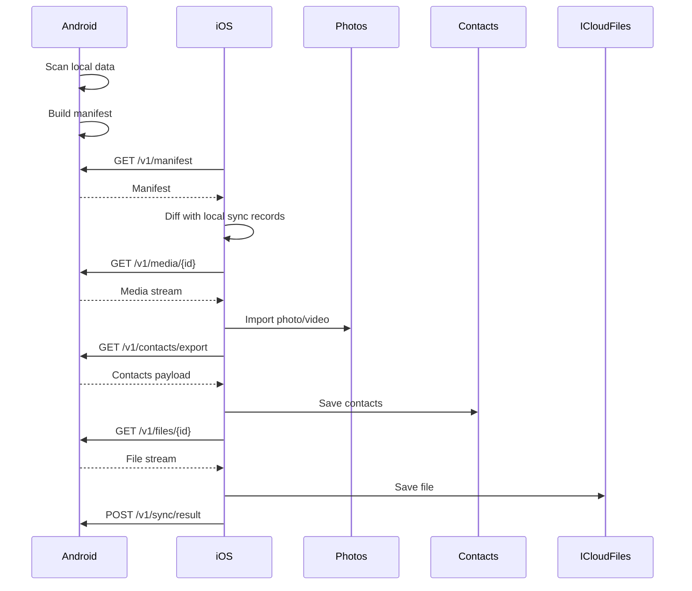

# ShareSync 實作規範

版本：v0.1  
日期：2026-08-19  
適用範圍：Android Kotlin App、iOS Swift App  
用途：實際開發規範、模組拆分、同步協定、資料模型、PoC 與 MVP 實作依據

## 1. 文件目的

本文件定義 ShareSync 的實際工程實作規格。ShareSync 是一套 Android 與 iOS 雙機本地同步系統，主要讓 Android 主力機透過 iPhone 寫入 iCloud 可同步位置。

本文件供 Android、iOS、QA、產品設計與後續維護工程師使用。若本文件與產品企劃書衝突，工程實作以本文件為準；產品定位、商業規劃與市場策略以 `product-development-plan.md` 為準。

## 2. MVP 實作範圍

### 2.1 必做功能

MVP 需完成：

- 目前第一版 MVP 切片先只完成 Android 照片到 iOS Photos；影片、聯絡人與文件列為後續 MVP 擴充。
- Android 與 iPhone QR code 首次配對。
- 裝置信任資料儲存與解除配對。
- Android 掃描照片、影片、聯絡人、指定文件資料夾。
- Android 產生同步 manifest。
- Android 開啟本地 HTTPS server。
- iOS 透過 local HTTPS 拉取 manifest 與資料。
- iOS 將照片與影片寫入 Photos。
- iOS 將聯絡人寫入 Contacts。
- iOS 將文件寫入 App iCloud Documents container。
- 基礎去重。
- 同步紀錄。
- 失敗重試。
- 中斷恢復。
- 本地通知保底。
- 權限引導與權限狀態檢查。

### 2.2 MVP 不做

MVP 不做：

- SMS、iMessage、通話紀錄。
- WhatsApp、LINE、Messenger 等第三方 App 聊天資料。
- 任意 App sandbox data。
- 雙向刪除。
- 完整雙向自動合併。
- 外部雲端中繼。
- Apple ID 或 iCloud 帳密登入。
- 完整 iCloud Drive 全域掃描。

### 2.3 第二階段功能

第二階段可加入：

- iPhone 到 Android 反向同步。
- 雙向合併模式。
- 行事曆同步。
- Android hotspot 備援。
- 更完整的衝突處理。

## 3. 平台與最低版本

### 3.1 Android

語言：Kotlin  
最低版本：Android 10，API 29  
建議目標版本：最新 Android SDK  

主要使用：

- WorkManager
- ForegroundService
- MediaStore
- ContactsProvider
- Storage Access Framework
- Bluetooth LE
- Network sockets
- Room
- Kotlin Coroutines
- OkHttp
- Ktor server 或 NanoHTTPD 類嵌入式 server
- Android Keystore

### 3.2 iOS

語言：Swift  
最低版本：iOS 17  
建議目標版本：最新 iOS SDK  

主要使用：

- SwiftUI
- BGTaskScheduler
- URLSessionConfiguration.background
- PhotoKit
- Contacts
- CoreBluetooth
- Network.framework
- FileManager
- iCloud Documents capability
- SQLite 或 Core Data
- Keychain
- CryptoKit

## 4. 系統角色

### 4.1 Android App

Android 是 MVP 的同步主控端。

負責：

- 掃描資料變化。
- 產生 manifest。
- 維護 sync queue。
- 開啟本地 HTTPS server。
- 發起裝置發現。
- 顯示同步進度。
- 管理重試與失敗恢復。
- 保存同步狀態。

### 4.2 iOS App

iOS 是 MVP 的接收與 iCloud gateway 端。

負責：

- 掃描 QR code 完成配對。
- 連線 Android local server。
- 拉取 manifest。
- 下載資料。
- 寫入 Photos、Contacts、iCloud Documents container。
- 保存匯入結果。
- 在背景不可用時提示使用者打開 App。

## 5. 高階資料流



## 6. Android 專案模組

建議 package 結構：

```text
com.sharesync.android
  app
  ui
  pairing
  discovery
  transfer
  transfer.server
  transfer.client
  scanner
  scanner.media
  scanner.contacts
  scanner.files
  sync
  sync.queue
  sync.manifest
  persistence
  security
  permissions
  diagnostics
```

### 6.1 `pairing`

負責：

- 產生 QR pairing payload。
- 驗證 iOS pairing request。
- 建立 trusted device。
- 解除配對。

### 6.2 `scanner.media`

負責：

- 使用 MediaStore 掃描照片與影片。
- 保存 media cursor。
- 產生 `MediaAsset`。
- 偵測新增與更新。

### 6.3 `scanner.contacts`

負責：

- 使用 ContactsProvider 掃描聯絡人。
- 轉換為 normalized contact model。
- 產生 contact hash。

### 6.4 `scanner.files`

負責：

- 使用 Storage Access Framework 掃描使用者授權資料夾。
- 保存 tree URI。
- 建立 file item。

### 6.5 `transfer.server`

負責：

- 啟動 local HTTPS server。
- 提供 manifest API。
- 提供 media/file streaming API。
- 提供 contacts export API。
- 驗證 request signature。
- 支援 range request。

### 6.6 `sync`

負責：

- 建立同步任務。
- 管理 item 狀態。
- 保存同步結果。
- 重試失敗項目。

## 7. iOS 專案模組

建議 target/module 結構：

```text
ShareSync
  App
  UI
  Pairing
  Discovery
  Transfer
  Importer
  ImporterPhotos
  ImporterContacts
  ImporterFiles
  Sync
  Persistence
  Security
  Permissions
  Diagnostics
```

### 7.1 `Pairing`

負責：

- 掃描 Android QR code。
- 解析 pairing payload。
- 產生 iOS key pair。
- 呼叫 Android pairing API。
- 儲存 trusted device。

### 7.2 `Transfer`

負責：

- 建立 Android server 連線。
- 使用 background URLSession 下載大檔。
- 管理 download task。
- 支援中斷恢復。
- 驗證 hash。

### 7.3 `ImporterPhotos`

負責：

- 建立 `ShareSync Backup` 相簿。
- 使用 PhotoKit 寫入照片與影片。
- 保存 Android asset id 到 iOS local identifier mapping。
- 分批匯入。

### 7.4 `ImporterContacts`

負責：

- 將 Android contact model 轉為 `CNMutableContact`。
- 執行保守合併。
- 寫入 Contacts。
- 保存 mapping。

### 7.5 `ImporterFiles`

負責：

- 確認 iCloud Documents container 可用。
- 建立目錄結構。
- 寫入文件。
- 處理同名衝突。

### 7.6 `Sync`

負責：

- 讀取 manifest。
- 計算待下載項目。
- 排程下載。
- 呼叫 importer。
- 回報結果給 Android。

## 8. 配對協定

### 8.1 QR Payload

Android 顯示 QR code，內容為 JSON。MVP 可使用以下格式：

```json
{
  "version": 1,
  "type": "sharesync_pairing",
  "deviceId": "android-device-uuid",
  "deviceName": "Pixel 9 Pro",
  "platform": "android",
  "publicKey": "base64-public-key",
  "ip": "192.168.1.20",
  "port": 48291,
  "pairingToken": "short-lived-random-token",
  "expiresAt": "2026-08-19T06:30:00Z"
}
```

### 8.2 Pairing API

```http
POST /v1/pairing/accept
Content-Type: application/json
```

Request：

```json
{
  "version": 1,
  "deviceId": "ios-device-uuid",
  "deviceName": "Ming's iPhone",
  "platform": "ios",
  "publicKey": "base64-public-key",
  "pairingToken": "short-lived-random-token",
  "signature": "base64-signature"
}
```

Response：

```json
{
  "trustedDeviceId": "ios-device-uuid",
  "sessionId": "session-id",
  "expiresAt": "2026-08-19T07:30:00Z"
}
```

### 8.3 配對規則

- `pairingToken` 有效時間最多 10 分鐘。
- 配對完成後 token 立即失效。
- QR code 不得包含私鑰。
- public key 保存在 trusted device record。
- 使用者可在任一端解除配對。

## 9. Request 驗證

所有已配對後的 API request 需包含：

```text
X-ShareSync-Version: 1
X-Device-Id: device-id
X-Session-Id: session-id
X-Timestamp: unix-ms
X-Nonce: random-string
X-Signature: base64-signature
```

簽章內容：

```text
METHOD + "\n" +
PATH + "\n" +
X-Timestamp + "\n" +
X-Nonce + "\n" +
SHA256(body)
```

驗證規則：

- timestamp 與本機時間差不可超過 5 分鐘。
- nonce 不可重複。
- session 不可過期。
- signature 必須使用 trusted public key 驗證通過。

## 10. Local HTTPS API

### 10.1 Health

```http
GET /v1/health
```

Response：

```json
{
  "status": "ok",
  "deviceId": "android-device-uuid",
  "appVersion": "0.1.0",
  "protocolVersion": 1
}
```

### 10.2 Manifest

```http
GET /v1/manifest?sinceCursor={cursor}
```

Response：

```json
{
  "version": 1,
  "sourceDeviceId": "android-device-uuid",
  "generatedAt": "2026-08-19T06:00:00Z",
  "cursor": "cursor-value",
  "media": [],
  "contacts": [],
  "files": []
}
```

### 10.3 Media Download

```http
GET /v1/media/{assetId}
Range: bytes=0-
```

Response headers：

```text
Content-Type: image/jpeg
Content-Length: 123456
Accept-Ranges: bytes
X-ShareSync-Asset-Id: asset-id
X-ShareSync-SHA256: sha256-hash
```

### 10.4 Contacts Export

```http
GET /v1/contacts/export?ids=id1,id2,id3
```

Response：

```json
{
  "version": 1,
  "contacts": []
}
```

### 10.5 File Download

```http
GET /v1/files/{fileId}
Range: bytes=0-
```

Response headers：

```text
Content-Type: application/octet-stream
Content-Length: 123456
Accept-Ranges: bytes
X-ShareSync-File-Id: file-id
X-ShareSync-SHA256: sha256-hash
```

### 10.6 Sync Result

```http
POST /v1/sync/result
Content-Type: application/json
```

Request：

```json
{
  "syncBatchId": "batch-id",
  "targetDeviceId": "ios-device-uuid",
  "results": [
    {
      "itemType": "media",
      "sourceItemId": "asset-id",
      "targetItemId": "ios-local-identifier",
      "status": "synced",
      "errorCode": null
    }
  ]
}
```

## 11. 資料模型

### 11.1 Device

```json
{
  "deviceId": "string",
  "deviceName": "string",
  "platform": "android | ios",
  "publicKey": "string",
  "pairedAt": "datetime",
  "lastSeenAt": "datetime",
  "trustStatus": "trusted | revoked"
}
```

### 11.2 MediaAsset

```json
{
  "assetId": "string",
  "sourceDeviceId": "string",
  "mediaType": "photo | video",
  "fileName": "string",
  "mimeType": "string",
  "size": 123456,
  "sha256": "string",
  "createdAt": "datetime",
  "modifiedAt": "datetime",
  "takenAt": "datetime",
  "width": 4032,
  "height": 3024,
  "durationMs": null,
  "relativePath": "DCIM/Camera"
}
```

### 11.3 ContactItem

```json
{
  "contactId": "string",
  "sourceDeviceId": "string",
  "displayName": "string",
  "givenName": "string",
  "familyName": "string",
  "phones": [
    {
      "label": "mobile",
      "value": "+886900000000",
      "normalizedValue": "+886900000000"
    }
  ],
  "emails": [],
  "organization": null,
  "note": null,
  "sha256": "string",
  "modifiedAt": "datetime"
}
```

### 11.4 FileItem

```json
{
  "fileId": "string",
  "sourceDeviceId": "string",
  "fileName": "string",
  "relativePath": "Documents/Receipts",
  "mimeType": "application/pdf",
  "size": 123456,
  "sha256": "string",
  "modifiedAt": "datetime"
}
```

### 11.5 SyncRecord

```json
{
  "syncRecordId": "string",
  "sourceDeviceId": "string",
  "targetDeviceId": "string",
  "itemType": "media | contact | file",
  "sourceItemId": "string",
  "sourceHash": "string",
  "targetItemId": "string",
  "status": "pending | transferring | imported | synced | failed | skipped | conflicted",
  "attemptCount": 0,
  "lastAttemptAt": "datetime",
  "syncedAt": "datetime",
  "errorCode": "string",
  "errorMessage": "string"
}
```

## 12. 本機資料庫

### 12.1 Android Tables

必要資料表：

- `trusted_devices`
- `media_assets`
- `contact_items`
- `file_items`
- `sync_batches`
- `sync_records`
- `nonces`
- `settings`

### 12.2 iOS Tables

必要資料表：

- `trusted_devices`
- `remote_media_assets`
- `remote_contact_items`
- `remote_file_items`
- `sync_batches`
- `sync_records`
- `download_tasks`
- `nonces`
- `settings`

## 13. 同步狀態機

### 13.1 Item 狀態

```text
discovered
  -> queued
  -> transferring
  -> downloaded
  -> importing
  -> synced

queued
  -> skipped

transferring
  -> failed
  -> queued

importing
  -> failed
  -> conflicted
  -> synced
```

### 13.2 Batch 狀態

```text
created
  -> running
  -> partial_success
  -> completed
  -> failed
  -> cancelled
```

### 13.3 重試規則

- 網路錯誤：最多自動重試 3 次。
- hash mismatch：不自動視為成功，重新下載 1 次，仍失敗則標記 failed。
- 權限錯誤：不重試，提示使用者修正權限。
- 儲存空間不足：不重試，提示使用者清理空間。
- iOS background timeout：保存 checkpoint，下次繼續。

## 14. 去重規則

### 14.1 Media

判斷順序：

1. sourceDeviceId + sourceItemId 已有成功 sync record。
2. sha256 已存在。
3. sha256 不可用時，比對 size + takenAt + fileName。

處理：

- 命中成功紀錄：跳過。
- 命中 hash：跳過。
- 同名不同 hash：匯入並保留原檔名或由系統自動命名。

### 14.2 Contacts

匹配順序：

1. sourceDeviceId + source contact id mapping。
2. normalized phone。
3. normalized email。
4. displayName + phone/email。

處理：

- 已有 mapping：更新或跳過。
- phone/email 匹配：合併欄位。
- 不確定匹配：新增新聯絡人。
- MVP 不刪除任何聯絡人。

### 14.3 Files

判斷順序：

1. sourceDeviceId + source file id mapping。
2. sha256。
3. relativePath + fileName + size + modifiedAt。

處理：

- 同 hash：跳過。
- 同路徑不同 hash：寫入副本。
- 副本命名格式：`name (Android).ext`。

## 15. iOS 匯入規範

### 15.1 Photos 匯入

相簿名稱：

```text
ShareSync Backup
```

批次大小：

- 照片：每批最多 50 張。
- 影片：每批最多 5 個，或總大小不超過 1GB。

每批流程：

1. 確認 Photos 權限。
2. 確認暫存檔存在。
3. 驗證 sha256。
4. 使用 `PHPhotoLibrary.performChanges` 寫入。
5. 取得 local identifier。
6. 寫入 sync record。
7. 刪除暫存檔。

### 15.2 Contacts 匯入

每批最多 100 筆。

流程：

1. 確認 Contacts 權限。
2. 依匹配規則找現有聯絡人。
3. 建立 `CNSaveRequest`。
4. 合併或新增。
5. 寫入 mapping。

### 15.3 Files 匯入

根目錄：

```text
iCloud Drive/ShareSync/
```

子目錄：

```text
iCloud Drive/ShareSync/Android/{deviceName}/
```

流程：

1. 確認 iCloud Documents container 可用。
2. 建立目錄。
3. 驗證 sha256。
4. 若同名衝突，產生副本檔名。
5. 移動暫存檔到目標位置。
6. 寫入 sync record。

## 16. Android 掃描規範

### 16.1 Media 掃描

查詢欄位：

- `_ID`
- `DISPLAY_NAME`
- `MIME_TYPE`
- `SIZE`
- `DATE_ADDED`
- `DATE_MODIFIED`
- `DATE_TAKEN`
- `RELATIVE_PATH`
- `WIDTH`
- `HEIGHT`
- `DURATION`

掃描策略：

- 初次全量掃描。
- 後續使用 `DATE_MODIFIED` cursor 增量掃描。
- 檔案 hash 可延後到傳輸前計算，避免掃描階段太耗電。

### 16.2 Contacts 掃描

掃描策略：

- 初次全量掃描。
- 使用 contact last updated timestamp 或系統可用欄位做增量。
- 若裝置廠商資料不可靠，定期全量建立 hash diff。

### 16.3 Files 掃描

掃描策略：

- 使用 SAF tree URI。
- 初次全量掃描。
- 後續使用 modified time 與 size diff。
- hash 延後計算。

## 17. 背景任務規範

### 17.1 Android

WorkManager：

- 每 6 小時掃描一次。
- 裝置充電與 Wi-Fi 條件下優先執行。
- 使用 constraints 控制耗電。

ForegroundService：

- 使用者手動同步。
- 大批次傳輸。
- 需要長時間保持 local server 活動。

通知：

- 顯示同步進度。
- 可暫停。
- 可取消。

### 17.2 iOS

BGTaskScheduler：

- 註冊背景 refresh 或 processing task。
- 嘗試定期檢查 paired Android。
- 不依賴它作為唯一同步來源。

Background URLSession：

- 用於檔案下載。
- session identifier 必須穩定。
- app relaunch 後需 reconnect completion handler。

Local notification：

- 當 iOS 無法完成背景匯入時提示使用者。
- 點擊通知後自動恢復 sync batch。

## 18. 權限規範

### 18.1 Android

首次使用不一次請求所有權限。依功能延後請求。

照片/影片同步：

- Android 13+ 使用 Photos and Videos permission。
- Android 10-12 使用對應 storage/media 權限與 MediaStore。

聯絡人同步：

- READ_CONTACTS。
- WRITE_CONTACTS 僅在反向同步階段需要。

文件同步：

- 使用 Storage Access Framework，避免廣泛 storage 權限。

BLE：

- Android 12+ 使用 BLUETOOTH_SCAN、BLUETOOTH_CONNECT、BLUETOOTH_ADVERTISE。

通知：

- Android 13+ 使用 POST_NOTIFICATIONS。

### 18.2 iOS

Photos：

- MVP Android 到 iPhone 可優先請求 add-only。
- 反向同步需要 read/write。

Contacts：

- Android 到 iPhone 需要 write。
- iPhone 到 Android 需要 read。

Bluetooth：

- 用於 discovery 與喚醒提示。

Local Network：

- 用於連線 Android local server。

Notifications：

- 用於同步保底提示。

iCloud Documents：

- 需啟用 capability。
- App 啟動時檢查 container 是否可用。

## 19. 錯誤碼

錯誤碼格式：

```text
SS-{DOMAIN}-{CODE}
```

Domain：

- `PAIR`
- `AUTH`
- `NET`
- `MEDIA`
- `CONTACT`
- `FILE`
- `PERM`
- `STORE`
- `IOSBG`

範例：

| 錯誤碼 | 說明 | 使用者訊息 |
|---|---|---|
| SS-PAIR-001 | QR expired | 配對碼已過期，請重新產生 |
| SS-AUTH-001 | Invalid signature | 裝置驗證失敗，請重新配對 |
| SS-NET-001 | Cannot reach peer | 找不到另一台手機，請確認同 Wi-Fi |
| SS-NET-002 | Transfer interrupted | 傳輸中斷，稍後會自動繼續 |
| SS-MEDIA-001 | Hash mismatch | 檔案驗證失敗，將重新下載 |
| SS-CONTACT-001 | Contact permission denied | 請允許聯絡人權限 |
| SS-FILE-001 | iCloud container unavailable | iCloud Drive 尚不可用 |
| SS-PERM-001 | Photos permission denied | 請允許照片權限 |
| SS-STORE-001 | Not enough storage | 儲存空間不足 |
| SS-IOSBG-001 | Background time expired | iOS 背景時間已結束，請開啟 App 繼續 |

## 20. Logging 與診斷

### 20.1 本機 Log

需記錄：

- pairing events。
- sync batch start/end。
- item status changes。
- transfer speed。
- retry count。
- permission status。
- error code。

不得記錄：

- 聯絡人完整電話與 email。
- 檔案內容。
- 照片 metadata 中的精確 GPS，除非使用者明確同意診斷匯出。
- private key。

### 20.2 診斷匯出

支援使用者手動匯出診斷 ZIP。

內容：

- app version。
- device model。
- OS version。
- sync summary。
- error codes。
- redacted logs。

不得包含使用者原始檔案內容。

## 21. UI 實作需求

### 21.1 Android 必要畫面

- Welcome / role explanation。
- Pairing QR code。
- Paired device detail。
- Permission checklist。
- Sync source selection。
- Sync dashboard。
- Sync progress。
- Sync history。
- Error detail。
- Settings。

### 21.2 iOS 必要畫面

- Welcome / gateway explanation。
- QR scanner。
- Paired device detail。
- Permission checklist。
- iCloud readiness check。
- Receive dashboard。
- Import progress。
- Sync history。
- Error detail。
- Settings。

### 21.3 文案原則

必須清楚說明：

- 資料只在兩台手機間傳輸。
- iPhone 背景同步受 iOS 系統限制。
- 最佳自動同步條件是同 Wi-Fi、iPhone 充電、Background App Refresh 開啟。
- 若自動同步未啟動，點擊通知或打開 App 即可繼續。

## 22. PoC 實作任務

### 22.1 Android PoC

任務：

1. 建立 Kotlin Android project。
2. 實作 QR payload 產生。
3. 實作 MediaStore 掃描最近 100 張照片。
4. 建立 manifest。
5. 開啟 local HTTP server。PoC 可先使用 HTTP，MVP 必須升級 HTTPS。
6. 提供 `/v1/manifest`。
7. 提供 `/v1/media/{assetId}`。
8. 支援 basic range request。

### 22.2 iOS PoC

任務：

1. 建立 Swift iOS project。
2. 實作 QR scanner。
3. 解析 Android payload。
4. 呼叫 `/v1/manifest`。
5. 下載 100 張照片。
6. 驗證 sha256。
7. 建立 `ShareSync Backup` 相簿。
8. 寫入 Photos。
9. 保存 sync record。
10. 重複執行不得重複匯入。

### 22.3 PoC 驗收

PoC 通過條件：

- iOS 可成功掃描 Android QR code。
- iOS 可取得 Android manifest。
- iOS 可下載至少 100 張照片。
- iOS 可寫入 Photos。
- 重跑同步不重複匯入。
- 中斷後可從已完成項目繼續。
- 錯誤可顯示明確原因。

## 23. MVP 實作任務

### 23.1 Sprint 建議

Sprint 1：

- 專案初始化。
- 基礎 UI。
- QR 配對。
- trusted device persistence。

Sprint 2：

- Android media scanner。
- Android local server。
- iOS manifest client。
- iOS media download。

Sprint 3：

- iOS Photos importer。
- sync records。
- 去重。
- 失敗恢復。

Sprint 4：

- Android contacts scanner。
- iOS contacts importer。
- 聯絡人保守合併。

Sprint 5：

- Android files scanner。
- iOS iCloud Documents importer。
- 同名衝突處理。

Sprint 6：

- 權限引導。
- 同步 dashboard。
- progress UI。
- notification fallback。

Sprint 7：

- BLE discovery prototype。
- 背景任務整合。
- 大檔案測試。

Sprint 8：

- QA 修正。
- 診斷 log。
- Store 隱私文案。
- Beta release。

## 24. 測試規範

### 24.1 單元測試

必測：

- manifest diff。
- hash calculation。
- contact normalization。
- duplicate detection。
- file conflict naming。
- request signature。
- timestamp validation。
- retry policy。

### 24.2 整合測試

必測：

- Android manifest API。
- iOS manifest parsing。
- media download。
- file range request。
- contacts export/import。
- sync result reporting。

### 24.3 手動 QA

必測情境：

- 首次配對。
- 解除配對後重新配對。
- 權限拒絕後重新允許。
- 1000 張照片同步。
- 單一大影片同步。
- Wi-Fi 中斷後恢復。
- iPhone 鎖屏。
- Android App 被切到背景。
- iPhone 儲存空間不足。
- iCloud Drive 關閉。

## 25. App Store 與 Play Store 實作注意

### 25.1 iOS

不得使用 private API。  
不得暗示可讀取 iMessage、SMS 或所有 iCloud Drive 資料。  
不得要求 Apple ID 帳密。  
權限說明需明確、具體。

### 25.2 Android

ForegroundService 必須顯示持續通知。  
照片、聯絡人、藍牙與通知權限需與實際功能一致。  
不應要求過度廣泛的檔案權限，優先使用 SAF。

## 26. 開發決策

MVP 固定決策：

- Android 是主控端。
- iOS 是接收端。
- 大資料傳輸走 local HTTPS。
- BLE 不作為大檔案傳輸通道。
- QR code 用於首次配對。
- 不使用第三方雲端中繼。
- 不保存 Apple ID。
- 第一版 MVP 先只做照片同步。
- MVP 不做刪除同步。
- MVP 不做聊天資料。
- iOS 背景同步不可作為唯一成功路徑。

待 PoC 後決定：

- HTTPS 憑證實作方式。
- BLE discovery 是否納入 MVP 或延後。
- iOS background URLSession 實際成功率。
- iOS 匯入 Photos 的最佳批次大小。
- Android hotspot 是否納入 MVP。

## 27. Definition of Done

一項同步功能完成需符合：

- 有明確權限處理。
- 有資料掃描或匯入實作。
- 有 sync record。
- 有去重邏輯。
- 有錯誤碼。
- 有失敗恢復策略。
- 有基本單元測試。
- 有手動 QA case。
- 不記錄敏感內容。
- 使用者可在 UI 中理解目前狀態。

## 28. 第一個開發里程碑

第一個里程碑名稱：

```text
M0 - Android to iOS Photo PoC
```

完成標準：

1. Android 顯示 QR code。
2. iOS 掃描 QR code。
3. iOS 連線 Android。
4. iOS 取得 manifest。
5. iOS 下載 100 張照片。
6. iOS 寫入 ShareSync Backup 相簿。
7. 重跑不重複。
8. 中斷後可繼續。
9. 產出測試報告。

M0 完成後再進入完整 MVP。
