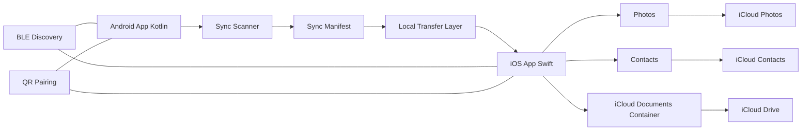

# ShareSync 開發企劃書

版本：v0.1  
日期：2026-08-19  
開發策略：Android Kotlin 原生開發，iOS Swift 原生開發  
產品定位：雙手機本地同步，讓 Android 主力機透過 iPhone 進入 iCloud 備份體系

## 1. 企劃摘要

ShareSync 是一款針對「單人同時持有 Android 與 iPhone」情境設計的雙系統本地同步 App。

目標使用者的主力手機是 Android，但希望利用 iPhone 與 iCloud 備份照片、影片、聯絡人與文件。ShareSync 不透過第三方雲端中繼，不將使用者資料上傳到外部伺服器，而是讓 Android 與 iPhone 在同一 Wi-Fi、Android hotspot 或近距離連線條件下直接傳輸資料。

Android 端負責自動掃描資料、建立同步清單、發起傳輸與排程。iOS 端負責接收資料，並寫入 iOS 系統資料庫，包括 Photos、Contacts 與 iCloud Documents container。資料進入 iPhone 後，再由 iCloud Photos、iCloud Contacts 或 iCloud Drive 完成 Apple 生態內的同步與備份。

本產品的核心承諾不是「Android 直接原生同步 iCloud」，而是：

> 讓 Android 手機透過一台 iPhone，私密、低摩擦地備份到 iCloud。

## 2. 背景與問題

目前市場上已有大量 Android 到 iPhone 的一次性搬機工具，例如 Apple Move to iOS、MobileTrans、Copy My Data 等。這類產品主要處理「換新機」情境，通常在使用者從 Android 換到 iPhone 時使用。

然而，有一群使用者並不是要換機，而是長期同時持有兩台手機：

- Android 是主力拍照機、工作機或日常使用手機。
- iPhone 可能是備用機、家庭共享設備、iCloud 中繼設備。
- 使用者已購買 iCloud 或 Apple One。
- 使用者希望 Android 拍攝的照片、影片、聯絡人與文件也能進入 iCloud。
- 使用者不希望資料再上傳到 Google Photos、Dropbox、OneDrive 或其他第三方雲端。

這形成一個現有產品沒有完整覆蓋的需求：

> Android 持續產生資料，但使用者想使用 iCloud 作為主要備份與整理中心。

## 3. 產品目標

### 3.1 核心目標

建立一套本地、私密、可恢復的 Android 與 iOS 雙機同步系統，支援 Android 資料透過 iPhone 寫入 iCloud 可同步位置。

### 3.2 MVP 目標

MVP 需完成以下能力：

1. Android 與 iPhone 首次安全配對。
2. Android 掃描照片、影片、聯絡人與指定文件資料夾。
3. Android 與 iPhone 在本地網路中傳輸資料。
4. iPhone 將接收的照片與影片寫入 Photos。
5. iPhone 將接收的聯絡人寫入 Contacts。
6. iPhone 將接收的文件寫入 App 的 iCloud Documents container。
7. 支援同步紀錄、去重、失敗恢復與基礎錯誤提示。
8. 在 iOS 無法背景接收時，提供低摩擦的一鍵同步保底流程。

### 3.3 非目標

MVP 階段不處理以下項目：

- SMS 與通話紀錄同步。
- iMessage 同步。
- WhatsApp、LINE、Telegram 等第三方 App 聊天紀錄遷移。
- 任意 App data 遷移。
- 雙向刪除同步。
- 完全無感的 iOS 常駐背景同步。
- 使用 Apple ID 帳密直接登入 iCloud。
- 透過第三方雲端中繼資料。

## 4. 產品定位

### 4.1 建議定位

ShareSync 應定位為：

> Private local bridge from Android to iCloud.

中文可描述為：

> 讓 Android 手機透過 iPhone 私密備份到 iCloud。

### 4.2 不建議定位

避免使用以下容易造成誤解或審核風險的說法：

- Android 直接同步 iCloud。
- 完整取代 iCloud Photos。
- Android 原生 iCloud 客戶端。
- 全自動無限制背景同步。
- 可同步所有手機資料。

### 4.3 使用者心智

使用者應理解：

- Android 是資料來源與同步主控端。
- iPhone 是 iCloud gateway。
- 資料只在兩台手機本地傳輸。
- iOS 背景能力受系統限制，因此部分情境需要開啟 App 或點擊通知完成同步。
- 一旦資料寫入 iPhone Photos、Contacts 或 iCloud Drive，後續由 iCloud 自行同步。

## 5. 目標使用者

### 5.1 主要客群

1. 同時持有 Android 與 iPhone 的個人使用者。
2. 主力手機為 Android，但家中使用 iPad、Mac 或 iCloud Photos。
3. 已購買 iCloud storage 或 Apple One 的使用者。
4. 不希望資料再上傳到第三方雲端的隱私敏感使用者。
5. 有閒置 iPhone，希望將其作為備份中繼設備的使用者。

### 5.2 使用情境

情境一：Android 是主力拍照機

使用者平常用 Android 拍照，但家中相簿整理都在 iPhone、iPad、Mac 與 iCloud Photos。ShareSync 可定期將 Android 新照片傳到 iPhone，讓它們進入 iCloud Photos。

情境二：Android 是工作機

使用者工作聯絡人主要存在 Android，但希望 iPhone 與 iCloud Contacts 也保有備份。ShareSync 可將 Android 聯絡人同步到 iPhone Contacts。

情境三：Android 下載與文件備份

使用者在 Android 上下載 PDF、收據、截圖或工作文件，想備份到 iCloud Drive。ShareSync 可同步指定資料夾到 iPhone 的 iCloud Documents container。

情境四：iPhone 作為備份盒

使用者有一台閒置 iPhone，長期充電並連接家中 Wi-Fi，用來接收 Android 資料並上傳 iCloud。

## 6. 市場與競品分析

### 6.1 官方換機工具

代表產品：

- Apple Move to iOS

特點：

- 適合 Android 到 iPhone 的新機設定流程。
- 支援通訊錄、訊息、照片、影片、檔案、WhatsApp、行事曆等資料。
- 主要是一次性搬移，而不是長期雙機同步。

缺口：

- 不適合已設定完成的 iPhone。
- 不適合長期持有兩台手機的同步情境。
- 不解決 Android 持續備份到 iCloud 的需求。

### 6.2 第三方搬機工具

代表產品：

- MobileTrans
- Copy My Data
- Smart Switch 類工具

特點：

- 主打一鍵換機。
- 支援照片、影片、聯絡人、文件與部分聊天資料。
- 多數仍是搬移工具，不是持續同步工具。

缺口：

- 常需要付費。
- 使用者對隱私與資料處理方式可能有疑慮。
- 不強調本地私密、不經雲端。
- 不專注 Android 主力機加 iCloud gateway 場景。

### 6.3 區網傳檔工具

代表產品：

- LocalSend
- PairDrop
- Send Anywhere

特點：

- 可跨平台傳檔。
- 區網或點對點傳輸。
- 使用彈性高。

缺口：

- 通常只處理檔案，不處理 Photos、Contacts、iCloud 寫入。
- 不做定期同步、manifest、去重與衝突管理。
- 不針對 iCloud 備份體驗最佳化。

### 6.4 雲端替代方案

代表產品：

- Google Photos
- Google Drive
- OneDrive
- Dropbox

特點：

- 跨平台成熟。
- 背景同步能力完整。

缺口：

- 資料進入第三方雲端，不是 iCloud。
- 不符合只想使用 iCloud 的使用者。
- 隱私敏感使用者可能不願採用。

### 6.5 市場機會

ShareSync 的差異化位置：

- 不是換機工具。
- 不是一般傳檔工具。
- 不是雲端硬碟。
- 是專為 Android 主力機與 iPhone/iCloud 備份情境設計的本地同步橋接器。

## 7. 技術選型

### 7.1 開發語言

Android：

- Kotlin

iOS：

- Swift

### 7.2 選擇原生開發的理由

本產品的成敗高度依賴平台底層能力：

- Android 背景任務。
- Android MediaStore。
- Android ContactsProvider。
- Android BLE。
- Android foreground service。
- iOS BGTaskScheduler。
- iOS background URLSession。
- iOS CoreBluetooth background mode。
- iOS PhotoKit。
- iOS Contacts。
- iOS iCloud Documents container。
- iOS local network permission。

使用 Kotlin 與 Swift 原生開發可最大化平台能力、降低背景任務不穩定風險，也更容易處理 App Store 與 Google Play 對權限、背景行為與隱私說明的要求。

### 7.3 不使用 Flutter 的理由

Flutter 適合 UI、設定頁與跨平台商業邏輯，但本產品核心不是 UI，而是平台背景能力與系統資料庫存取。若使用 Flutter，底層仍需大量 Kotlin/Swift plugin，反而增加架構複雜度。

因此第一版建議直接使用原生開發。

## 8. 系統總體架構



### 8.1 Android 角色

Android 是主控端，負責：

- 掃描資料變化。
- 建立同步 manifest。
- 管理同步 queue。
- 發起同步。
- 提供或請求本地 HTTPS 傳輸。
- 維護配對裝置狀態。
- 管理重試與失敗恢復。

### 8.2 iOS 角色

iOS 是 gateway 端，負責：

- 接收 Android 傳入資料。
- 將照片與影片寫入 Photos。
- 將聯絡人寫入 Contacts。
- 將文件寫入 iCloud Documents container。
- 嘗試背景接收與處理。
- 在無法背景完成時通知使用者一鍵繼續。

### 8.3 傳輸原則

- 不經外部雲端。
- 優先使用同 Wi-Fi 區網。
- 大資料走 HTTPS。
- BLE 僅做發現、喚醒與狀態提示。
- QR code 用於首次配對與保底連線。
- Android hotspot 作為無共同 Wi-Fi 時的備援。

## 9. 雙機傳輸設計

### 9.1 傳輸技術組合

```text
QR code = 首次配對與連線保底
BLE = 裝置發現、狀態通知、喚醒提示
Local HTTPS over Wi-Fi = 大量資料傳輸
Android hotspot = 無共同 Wi-Fi 時的備援
```

### 9.2 首次配對流程

1. Android 產生裝置 key pair。
2. Android 顯示 QR code，內容包含 device id、public key、臨時 IP/port、pairing token。
3. iPhone 掃描 QR code。
4. iPhone 產生自己的 key pair。
5. 雙方交換 public key。
6. 雙方建立 trusted device record。
7. 後續同步使用 session token 與簽章驗證。

### 9.3 同步連線流程

1. Android 掃描資料變化。
2. Android 透過 BLE 廣播「有待同步資料」。
3. iPhone 若可用，回應或在下次醒來時建立 session。
4. 雙方確認同一 Wi-Fi 或進入 hotspot 模式。
5. iPhone 透過 HTTPS 拉取 Android manifest。
6. iPhone 比對本地同步紀錄。
7. iPhone 分批下載資料。
8. iPhone 寫入 Photos、Contacts 或 Files。
9. iPhone 回傳同步結果。
10. Android 更新同步狀態。

### 9.4 API 草案

Android 提供：

```text
GET /v1/manifest
GET /v1/media/{assetId}
GET /v1/files/{fileId}
GET /v1/contacts/export
POST /v1/sync/result
POST /v1/session/refresh
```

iOS 提供反向同步時使用：

```text
GET /v1/manifest
GET /v1/media/{assetId}
GET /v1/files/{fileId}
GET /v1/contacts/export
POST /v1/sync/result
```

所有請求需包含：

```text
X-Device-Id
X-Session-Id
X-Timestamp
X-Signature
```

### 9.5 檔案傳輸要求

- 支援 chunk。
- 支援 resume。
- 支援 hash verify。
- 支援批次同步。
- 支援失敗重試。
- 支援網路切換後恢復。
- 大檔案需避免一次載入記憶體。

## 10. Android 技術方案

### 10.1 技術堆疊

- Kotlin
- Jetpack Compose 或 Android Views
- WorkManager
- ForegroundService
- MediaStore
- ContactsProvider
- Storage Access Framework
- Bluetooth LE APIs
- OkHttp
- Ktor server 或 embedded HTTP server
- Room
- Kotlin Coroutines

### 10.2 Android 模組設計

```text
android-app/
  pairing/
  discovery/
  transfer/
  scanner/
  media/
  contacts/
  files/
  sync-engine/
  persistence/
  security/
  ui/
```

### 10.3 Android 背景任務

使用 WorkManager 定期處理：

- 掃描新照片與影片。
- 掃描指定資料夾變更。
- 掃描聯絡人變更。
- 建立同步 manifest。
- 嘗試尋找 iPhone。

大量傳輸時使用 ForegroundService：

- 顯示同步進度通知。
- 降低任務被系統中止機率。
- 讓使用者可以暫停或取消同步。

### 10.4 Android 資料讀寫

照片與影片：

- 使用 MediaStore。
- 讀取 asset id、display name、mime type、date taken、date modified、size、relative path。
- 透過 ContentResolver stream 傳輸檔案。

聯絡人：

- 使用 ContactsProvider。
- 匯出為內部 normalized contact model。
- 可轉換為 vCard 作為交換格式。

文件：

- 使用 Storage Access Framework 讓使用者授權資料夾。
- 保存 tree URI。
- 掃描檔案 metadata。

### 10.5 Android 寫入反向同步資料

iPhone 回傳 Android 時：

- 照片/影片寫入 MediaStore。
- 聯絡人寫入 ContactsProvider。
- 文件寫入使用者選定資料夾。

## 11. iOS 技術方案

### 11.1 技術堆疊

- Swift
- SwiftUI 或 UIKit
- BGTaskScheduler
- URLSessionConfiguration.background
- CoreBluetooth
- PhotoKit
- Contacts
- EventKit
- FileManager
- Network.framework
- SQLite 或 Core Data
- CryptoKit

### 11.2 iOS 模組設計

```text
ios-app/
  pairing/
  discovery/
  transfer/
  importer/
  exporter/
  photos/
  contacts/
  files/
  sync-engine/
  persistence/
  security/
  ui/
```

### 11.3 iOS 背景限制

iOS 不允許一般 App 長時間常駐背景等待連線。可用能力包括：

- BGTaskScheduler：系統決定何時喚醒，不保證準時。
- Background URLSession：可在背景完成 HTTP/HTTPS 下載。
- CoreBluetooth background mode：可輔助 BLE 發現與連線事件，但不保證大量處理時間。
- Local notification：可提醒使用者點擊進入 App。

因此，iOS 端策略是：

- 能自動就自動。
- 不能自動時，以一鍵確認保底。
- 大檔案使用 background URLSession。
- 匯入動作分批執行。
- 每個批次都可恢復。

### 11.4 iOS 寫入 Photos

使用 PhotoKit：

- 請求 add-only 或 read/write 權限。
- 建立 ShareSync Backup 相簿。
- 分批寫入照片與影片。
- 保存 iOS local identifier 與 Android asset id mapping。

注意：

- 大量匯入可能被背景時間限制影響。
- 必須分批處理。
- 必須支援失敗後下次繼續。

### 11.5 iOS 寫入 Contacts

使用 Contacts framework：

- 請求 Contacts 權限。
- 將 Android contact model 轉為 CNMutableContact。
- 優先合併，不覆蓋。
- 保存 mapping。

注意：

- 若使用者 Contacts 預設帳號為 iCloud，新增聯絡人較容易進入 iCloud Contacts。
- App 應引導使用者確認 iCloud Contacts 已開啟。

### 11.6 iOS 寫入 Files/iCloud Drive

使用 App 的 iCloud Documents container：

- 開啟 iCloud Documents capability。
- 將 Android 文件寫入 App container。
- 使用者可在 Files app 中看到 ShareSync 文件。
- iCloud Drive 負責後續同步。

## 12. 同步模式

### 12.1 Android 到 iCloud 備份模式

這是 MVP 預設模式。

流程：

1. Android 掃描新資料。
2. Android 建立 manifest。
3. iPhone 連線並下載。
4. iPhone 寫入 Photos、Contacts、iCloud Documents。
5. iCloud 自行同步。

### 12.2 iPhone 到 Android 備份模式

第二階段支援。

流程：

1. Android 主動尋找 iPhone。
2. iPhone 在可用時提供 manifest。
3. Android 拉取 iPhone 資料。
4. Android 寫入相簿、通訊錄或資料夾。

### 12.3 雙向合併模式

第三階段支援。

原則：

- 照片與影片只新增，不刪除。
- 文件同名不同內容保留兩份。
- 聯絡人採保守合併。
- 衝突進入待確認清單。

## 13. 資料模型

### 13.1 Device

```json
{
  "deviceId": "string",
  "deviceName": "string",
  "platform": "android | ios",
  "publicKey": "string",
  "pairedAt": "datetime",
  "lastSeenAt": "datetime",
  "trustStatus": "trusted | revoked"
}
```

### 13.2 MediaAsset

```json
{
  "assetId": "string",
  "sourceDeviceId": "string",
  "type": "photo | video",
  "fileName": "string",
  "mimeType": "string",
  "size": 123456,
  "hash": "string",
  "createdAt": "datetime",
  "modifiedAt": "datetime",
  "exifDateTime": "datetime",
  "relativePath": "string"
}
```

### 13.3 Contact

```json
{
  "contactId": "string",
  "sourceDeviceId": "string",
  "displayName": "string",
  "givenName": "string",
  "familyName": "string",
  "phones": [],
  "emails": [],
  "addresses": [],
  "organization": "string",
  "hash": "string",
  "modifiedAt": "datetime"
}
```

### 13.4 FileItem

```json
{
  "fileId": "string",
  "sourceDeviceId": "string",
  "fileName": "string",
  "relativePath": "string",
  "mimeType": "string",
  "size": 123456,
  "hash": "string",
  "modifiedAt": "datetime"
}
```

### 13.5 SyncRecord

```json
{
  "syncId": "string",
  "sourceDeviceId": "string",
  "targetDeviceId": "string",
  "itemType": "media | contact | file",
  "sourceItemId": "string",
  "targetItemId": "string",
  "status": "pending | synced | failed | conflicted",
  "lastAttemptAt": "datetime",
  "syncedAt": "datetime",
  "errorCode": "string"
}
```

## 14. 去重與衝突策略

### 14.1 照片與影片

唯一性判斷：

- 優先使用 hash。
- 輔助使用 size、date taken、duration、EXIF。
- 同 hash 視為同一檔案。

處理規則：

- 已同步則跳過。
- 同名同 hash 跳過。
- 同名不同 hash 保留兩份。
- MVP 不同步刪除。

### 14.2 聯絡人

匹配規則：

- 電話號碼 normalized 後相同。
- email 相同。
- 姓名與主要電話相同。
- 姓名與主要 email 相同。

處理規則：

- 欄位互補時合併。
- 同欄位不同值時保留多值。
- 高風險衝突進入待確認。
- MVP 不自動刪除任何聯絡人。

### 14.3 文件

匹配規則：

- path + hash。
- file name + size + modified time。

處理規則：

- 同 hash 跳過。
- 同路徑不同 hash 保留副本。
- 副本命名：
  - `filename.ext`
  - `filename (Android).ext`
  - `filename (iPhone).ext`

## 15. 權限需求

### 15.1 Android 權限

依 Android 版本調整：

- Photos and videos access。
- Contacts read/write。
- Nearby devices / Bluetooth。
- Notification。
- Foreground service。
- Local network through normal socket usage。
- Storage Access Framework folder permission。

### 15.2 iOS 權限

- Photos add-only 或 read/write。
- Contacts。
- Bluetooth。
- Local Network。
- Background App Refresh。
- iCloud Documents capability。
- Notifications。

### 15.3 權限引導原則

每個權限都必須延後到使用者觸發相關功能時再請求，並使用明確文案說明：

- 為什麼需要。
- 會讀取哪些資料。
- 會寫入哪裡。
- 資料不會上傳第三方雲端。

## 16. 安全與隱私設計

### 16.1 核心原則

- 不保存 Apple ID。
- 不要求 iCloud 帳密。
- 不建置資料中繼雲端。
- 不上傳使用者內容至第三方伺服器。
- 裝置間傳輸加密。
- 使用者可撤銷配對。

### 16.2 配對安全

- QR code 交換 public key。
- 使用短效 pairing token。
- 配對完成後 token 失效。
- 裝置資料保存在本機 secure storage。

Android：

- Android Keystore。

iOS：

- Keychain。
- CryptoKit。

### 16.3 傳輸安全

- Local HTTPS。
- 每次同步使用 session token。
- Request signature。
- Timestamp 防重放。
- 檔案 hash 校驗。
- 可選擇應用層端對端加密。

### 16.4 隱私聲明重點

App Store 與 Google Play 需清楚說明：

- App 讀取照片、影片、聯絡人與文件是為了本地同步。
- 資料只在使用者配對的裝置間傳輸。
- 不會將資料上傳到開發者伺服器。
- 使用者可隨時刪除同步紀錄與解除配對。

## 17. 使用者體驗

### 17.1 首次使用流程

1. 選擇角色：
   - Android 主力機。
   - iPhone iCloud gateway。
2. Android 顯示配對 QR code。
3. iPhone 掃描 QR code。
4. 雙方完成信任。
5. iPhone 檢查 Photos、Contacts、iCloud Drive、Bluetooth、Local Network 權限。
6. Android 選擇同步資料類型。
7. 執行首次同步。

### 17.2 Android 主畫面

顯示：

- 已配對 iPhone。
- 上次同步時間。
- 待同步照片數量。
- 待同步影片大小。
- 待同步聯絡人數。
- 待同步文件數。
- iPhone 是否在線。
- 同步按鈕。

### 17.3 iOS 主畫面

顯示：

- 已配對 Android。
- 接收狀態。
- iCloud Photos 狀態檢查。
- iCloud Contacts 狀態提示。
- iCloud Drive container 狀態。
- 自動同步健康狀態。
- 一鍵接收按鈕。

### 17.4 自動同步健康狀態

iOS 顯示範例：

```text
自動同步狀態：良好
- Local Network 已允許
- Bluetooth 已允許
- Background App Refresh 已開啟
- iCloud Photos 已開啟
- iPhone 正在充電
- 與 Android 位於同一 Wi-Fi
```

狀態分級：

- 良好：可嘗試自動同步。
- 普通：可能需要開啟 App。
- 受限：缺少必要權限或 iCloud 未開啟。

### 17.5 iOS 低摩擦保底

當 iOS 無法自動完成：

- Android 顯示「等待 iPhone 接收」。
- iPhone 顯示本地通知：

```text
ShareSync
Android 有 128 張新照片待備份到 iCloud。點一下完成同步。
```

使用者點擊後：

- iOS App 開啟。
- 自動連線 Android。
- 繼續同步。

## 18. 開發階段規劃

### 18.1 Phase 0：技術驗證

時程：2 至 3 週

目標：

- 驗證雙機本地傳輸。
- 驗證 iOS background URLSession 可用性。
- 驗證 iOS 寫入 Photos 與 Contacts。
- 驗證 QR 配對與基礎加密。

範圍：

- Android 掃描 DCIM。
- Android 開 local HTTPS server。
- iOS 掃 QR code。
- iOS 下載 100 張照片。
- iOS 寫入 ShareSync Backup 相簿。
- 測試鎖屏、背景、充電、同 Wi-Fi、Android hotspot 情境。

交付物：

- Android PoC。
- iOS PoC。
- 背景同步測試報告。
- 技術風險修正建議。

### 18.2 Phase 1：MVP

時程：8 至 12 週

目標：

- 完成 Android 到 iPhone/iCloud 的可用產品。

範圍：

- QR 配對。
- 同 Wi-Fi 傳輸。
- Android 照片與影片同步。
- Android 聯絡人同步。
- Android 文件同步。
- iOS 寫入 Photos。
- iOS 寫入 Contacts。
- iOS 寫入 iCloud Documents container。
- 同步紀錄。
- 基礎去重。
- 失敗重試。
- 本地通知保底。
- 權限引導。

### 18.3 Phase 2：反向同步

時程：6 至 8 週

目標：

- 支援 iPhone 到 Android 備份。

範圍：

- iOS 匯出照片與影片。
- iOS 匯出聯絡人。
- iOS 匯出 App iCloud Documents container 文件。
- Android 寫入 MediaStore。
- Android 寫入 ContactsProvider。
- Android 寫入指定資料夾。
- 反向 manifest。

### 18.4 Phase 3：雙向合併與商業化

時程：6 至 10 週

目標：

- 強化雙向同步、穩定性與付費能力。

範圍：

- 雙向合併模式。
- 衝突處理 UI。
- 夜間同步模式。
- Android hotspot 備援。
- 多裝置管理。
- 付費方案。
- 診斷報告。
- App Store 與 Google Play 上架準備。

## 19. 測試計畫

### 19.1 裝置測試矩陣

Android：

- Samsung Galaxy。
- Google Pixel。
- Xiaomi / Redmi。
- OPPO / Vivo。
- Android 10 至最新版本。

iOS：

- iPhone 11 或更新。
- iOS 17 或更新。
- 至少測試 iPhone 充電、鎖屏、低電量、背景 App Refresh 開關。

### 19.2 網路測試

- 同 Wi-Fi。
- 2.4GHz Wi-Fi。
- 5GHz Wi-Fi。
- Android hotspot。
- Wi-Fi 中斷後恢復。
- IP 改變。
- 路由器 AP isolation 開啟。

### 19.3 資料量測試

- 100 張照片。
- 1,000 張照片。
- 10,000 張照片。
- 單一 5GB 影片。
- 1,000 筆聯絡人。
- 10,000 個小文件。

### 19.4 失敗情境測試

- 傳輸中 iPhone 鎖屏。
- 傳輸中 Android 被系統回收。
- 傳輸中 Wi-Fi 中斷。
- iOS Photos 權限被撤銷。
- iOS Contacts 權限被撤銷。
- iCloud Drive 關閉。
- 儲存空間不足。
- 重複同步。

## 20. 成功指標

### 20.1 技術指標

- 首次配對成功率 > 95%。
- 1000 張照片同步成功率 > 95%。
- 單次失敗後可恢復率 > 98%。
- 重複匯入率 < 1%。
- 聯絡人錯誤合併率 < 0.5%。
- 大檔案 hash 驗證成功率 > 99%。

### 20.2 產品指標

- 首次完成配對率 > 70%。
- 首次完成照片同步率 > 60%。
- 7 日留存 > 25%。
- 付費轉換率 > 3%。
- 權限設定完成率 > 65%。
- 因 iOS 背景限制造成的負評比例可控。

## 21. 主要風險與應對

| 風險 | 等級 | 應對 |
|---|---:|---|
| iOS 背景不穩定 | 高 | Android 主動，iOS 低摩擦確認，通知保底 |
| iOS 寫入 Photos 大量資料被中斷 | 高 | 分批匯入，queue，checkpoint，失敗恢復 |
| BLE 喚醒不保證 | 中高 | BLE 只作輔助，不作唯一入口 |
| 使用者誤解為完全自動 | 高 | 清楚文案與自動同步健康狀態 |
| 聯絡人合併錯誤 | 中高 | MVP 保守合併，不覆蓋，不刪除 |
| Local Network 權限被拒 | 中 | 權限教學，QR 與 hotspot 保底 |
| 大檔案傳輸中斷 | 中 | chunk、resume、hash verify |
| App Store 審核 | 中 | 清楚隱私說明，不宣稱繞過 iCloud |
| Android 背景限制 | 中 | WorkManager + ForegroundService |
| 儲存空間不足 | 中 | 預檢空間，分批同步，錯誤提示 |

## 22. 商業模式

### 22.1 免費版

- 單一 Android 配對單一 iPhone。
- 手動同步。
- 每日同步數量限制。
- 基礎照片備份。

### 22.2 付費版

- 無限制照片與影片同步。
- 聯絡人同步。
- 文件同步。
- 夜間同步模式。
- 反向同步。
- 雙向合併。
- 多裝置管理。
- 進階衝突處理。
- 優先支援。

### 22.3 定價假設

- 月付：US$2.99 至 US$4.99。
- 年付：US$19.99 至 US$29.99。
- 一次買斷：US$39.99 至 US$59.99。

## 23. 團隊與資源

### 23.1 MVP 最小團隊

- Android Engineer：1 人。
- iOS Engineer：1 人。
- Product Designer：1 人。
- QA：0.5 至 1 人。
- Product Owner：1 人，可由創辦人兼任。

### 23.2 技術分工

Android Engineer：

- Android 背景掃描。
- MediaStore。
- ContactsProvider。
- BLE。
- Local HTTPS server/client。
- Android UI。

iOS Engineer：

- iOS background URLSession。
- BGTaskScheduler。
- CoreBluetooth。
- PhotoKit。
- Contacts。
- iCloud Documents。
- iOS UI。

Product Designer：

- 首次配對流程。
- 權限引導。
- 同步狀態。
- 錯誤恢復。
- 衝突處理。

QA：

- 裝置矩陣測試。
- 背景同步測試。
- 大資料量測試。
- 權限與失敗情境測試。

## 24. PoC 詳細計畫

### 24.1 PoC 目標

驗證最核心假設：

> iPhone 可在本地網路中從 Android 下載照片，並可靠寫入 Photos，讓 iCloud Photos 後續備份。

### 24.2 PoC 範圍

Android：

- 掃描 DCIM 最近 100 張照片。
- 建立 manifest。
- 開啟 local HTTPS server。
- 顯示 QR code。

iOS：

- 掃描 QR code。
- 連線 Android。
- 使用 URLSession 下載照片。
- 寫入 ShareSync Backup 相簿。
- 保存同步紀錄。

### 24.3 PoC 測試條件

- iPhone 前景。
- iPhone 背景。
- iPhone 鎖屏。
- iPhone 充電。
- iPhone 未充電。
- 同 Wi-Fi。
- Android hotspot。
- 中途斷線後恢復。

### 24.4 PoC 通過條件

- 100 張照片可完整傳輸。
- 重複執行不重複匯入。
- 中斷後可繼續。
- iOS 寫入 Photos 成功率可接受。
- 使用者操作步驟不超過可接受範圍。

## 25. 上架與合規注意事項

### 25.1 App Store

需注意：

- 明確說明 Photos、Contacts、Bluetooth、Local Network 使用目的。
- 不宣稱可繞過 iCloud 限制。
- 不要求 Apple ID 密碼。
- 不使用私有 API。
- 不誤導使用者以為可讀取 iMessage 或系統 SMS。

### 25.2 Google Play

需注意：

- 照片與影片權限需符合實際用途。
- 聯絡人權限需清楚揭露。
- Foreground service 類型與通知需合規。
- 不收集與上傳非必要個資。

## 26. 建議路線圖

```text
Phase 0：PoC
  Android → iPhone 照片本地同步

Phase 1：MVP
  照片/影片 + 聯絡人 + 文件

Phase 2：反向同步
  iPhone → Android 備份

Phase 3：雙向合併
  衝突處理、夜間模式、多裝置

Phase 4：商業化
  付費方案、上架、穩定性優化
```

## 27. 結論

ShareSync 的方向具備可行性與差異化，但必須尊重 iOS 背景限制。最佳產品策略是：

- Android 端盡可能無感、自動、主動。
- iOS 端盡可能背景接收，但提供低摩擦確認保底。
- 資料只在兩台手機本地傳輸。
- iPhone 作為 iCloud gateway。
- MVP 聚焦照片、影片、聯絡人與文件。

使用 Kotlin 與 Swift 原生開發是合理且必要的選擇。這個產品的核心價值不是跨平台 UI，而是穩定使用 Android 與 iOS 的底層能力完成私密同步。

最建議的第一步是立即啟動 Phase 0 PoC，優先驗證：

1. Android local HTTPS server。
2. iOS background URLSession。
3. iOS Photos 寫入。
4. QR 安全配對。
5. 中斷恢復與去重。

PoC 通過後，再進入完整 MVP 開發。
