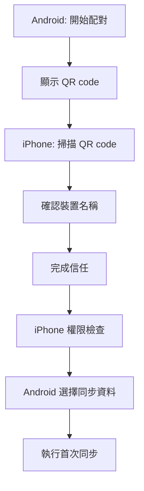
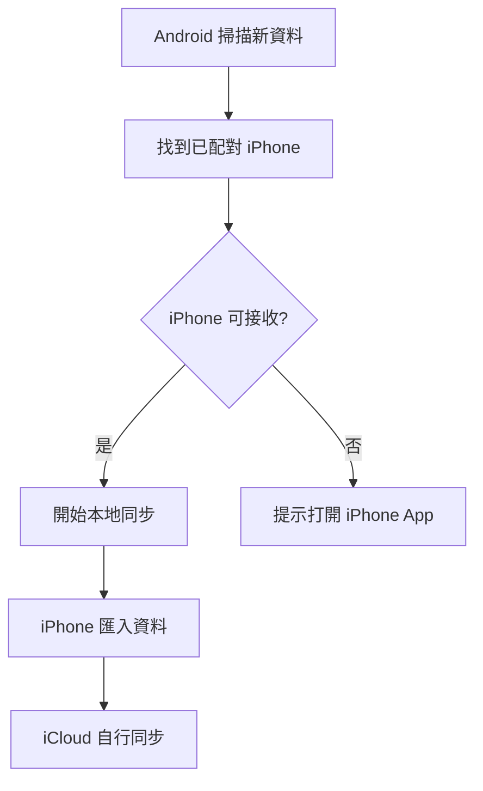

# ShareSync UI/UX 設計規範

版本：v0.1  
日期：2026-08-19  
適用範圍：Android Kotlin UI、iOS SwiftUI/UIKit UI  
目的：定義 ShareSync 的設計風格、資訊架構、主要畫面與互動原則

## 1. 設計定位

ShareSync 是一個私密、本地、跨裝置同步工具。UI 必須讓使用者感覺：

- 資料是安全的。
- 同步狀態是清楚的。
- iOS 限制是可理解的。
- 操作是低摩擦的。
- 這是一個可靠的系統工具，而不是一次性傳檔玩具。

設計語氣應是：

```text
安靜、可信、清楚、實用、略帶溫度
```

不應是：

```text
花俏、遊戲化、過度科技感、過度行銷、資訊不透明
```

## 2. 視覺風格

### 2.1 整體風格

採用「現代系統工具」風格：

- 高可讀性。
- 大量留白但不空洞。
- 狀態資訊清楚分層。
- 操作按鈕明確。
- 色彩克制。
- 少量動效用於同步狀態與成功回饋。

產品不做傳統 landing page hero。App 首屏應直接呈現目前同步狀態。

### 2.2 色彩方向

建議主色：

```text
Primary: #2563EB
```

用途：

- 主要 CTA。
- 連線成功。
- 同步中進度。
- 可操作重點。

輔助色：

```text
Success: #16A34A
Warning: #D97706
Error: #DC2626
Info: #0891B2
Neutral Text: #111827
Secondary Text: #6B7280
Background: #F8FAFC
Surface: #FFFFFF
Divider: #E5E7EB
```

避免：

- 整體大量紫藍漸層。
- 大面積深色科技風。
- 過多霓虹色。
- 單一藍色鋪滿所有區塊。

### 2.3 深色模式

需支援深色模式。

深色模式方向：

```text
Background: #0B1220
Surface: #111827
Primary: #60A5FA
Text Primary: #F9FAFB
Text Secondary: #9CA3AF
Divider: #243244
```

深色模式不可只反轉顏色，需確保：

- 同步狀態可讀。
- Warning/Error 不刺眼。
- 進度條對比足夠。

### 2.4 圓角與陰影

工具型 UI 不使用過度圓潤卡片。

建議：

- Card radius：8px。
- Button radius：8px。
- Input radius：8px。
- Sheet/modal radius：16px，依平台慣例調整。
- 陰影極少使用，優先使用邊框與背景層級。

## 3. 跨平台設計原則

### 3.1 保持平台原生感

Android 與 iOS 不需要 pixel-perfect 相同，而要資訊架構一致、平台操作自然。

Android：

- Material 3。
- Top app bar。
- Navigation bar 或 navigation rail。
- Permission flow 遵循 Android 慣例。

iOS：

- SwiftUI 原生 navigation。
- List/Form/Sheet。
- iOS-style permission explanation。
- 遵循 Human Interface Guidelines。

### 3.2 一致的資訊語言

兩端都使用相同的核心詞彙：

- 已配對裝置
- 待同步
- 同步中
- 已備份到 iPhone
- 等待 iPhone
- 需要開啟 App
- 自動同步狀態
- 本地傳輸
- 不經雲端中繼

避免使用太技術性的詞作為主文案：

- manifest
- endpoint
- background task
- local server
- hash
- cursor

這些只能出現在診斷頁或開發模式。

## 4. 資訊架構

### 4.1 Android 主要分頁

Android 是主力與控制端，首頁需偏「控制台」。

建議分頁：

1. 同步
2. 資料
3. 裝置
4. 記錄
5. 設定

### 4.2 iOS 主要分頁

iOS 是 gateway，首頁需偏「接收狀態與 iCloud 準備度」。

建議分頁：

1. 接收
2. iCloud
3. 裝置
4. 記錄
5. 設定

### 4.3 初期 MVP 可簡化

MVP 可先做三個主區：

- 首頁
- 裝置
- 設定

記錄與資料分類可放在首頁下方。

## 5. Android UI

### 5.1 Android 首頁

首頁目標：

- 讓使用者知道 Android 有多少資料待同步。
- 讓使用者知道 iPhone 是否可用。
- 讓使用者可以一鍵開始同步。

主要區塊：

```text
狀態列
  已連接 / 等待 iPhone / 需要開啟 iPhone App

同步摘要
  照片 128 張
  影片 3 個，1.2GB
  聯絡人 12 筆
  文件 34 個

主要操作
  立即同步

自動同步條件
  同 Wi-Fi
  iPhone 充電中
  Bluetooth 開啟
  最近已開啟 iPhone App

最近記錄
  今日 22:30 已同步 128 張照片
```

### 5.2 Android 配對頁

畫面重點：

- 大 QR code。
- 簡短步驟。
- 顯示目前 Wi-Fi。
- 顯示配對碼倒數。

文案範例：

```text
用 iPhone 掃描此碼
兩台手機會建立私密連線，資料只在本地網路傳輸。
```

### 5.3 Android 資料選擇頁

使用清楚的 toggle list：

- 照片
- 影片
- 聯絡人
- 文件資料夾

每個項目顯示：

- 開關。
- 最近掃描結果。
- 權限狀態。
- 最後同步時間。

### 5.4 Android 同步進度頁

同步中應顯示：

- 目前階段。
- 已完成數量。
- 傳輸速度。
- 剩餘估算。
- 目前檔案名稱，可截斷顯示。
- 暫停與取消。

狀態範例：

```text
正在傳送照片
42 / 128
18.4 MB/s
約 3 分鐘
```

## 6. iOS UI

### 6.1 iOS 首頁

首頁目標：

- 告訴使用者 iPhone 是否已準備好接收。
- 告訴使用者 iCloud 是否可用。
- 提供一鍵接收。

主要區塊：

```text
接收狀態
  已準備好 / 等待 Android / 需要權限 / iCloud 尚未開啟

iCloud 準備度
  iCloud Photos
  iCloud Contacts
  iCloud Drive

主要操作
  接收 Android 資料

自動同步條件
  同 Wi-Fi
  iPhone 充電中
  背景 App 重新整理已開啟
  Bluetooth 已允許

最近匯入
  今日 22:30 匯入 128 張照片到 ShareSync Backup
```

### 6.2 iOS 掃描配對頁

使用 iOS 原生 camera scanner。

畫面元素：

- 掃描框。
- 簡短說明。
- 手動輸入 IP 的備援入口。

文案範例：

```text
掃描 Android 上的配對碼
配對後，iPhone 會接收資料並寫入 iCloud 可同步的位置。
```

### 6.3 iOS 權限檢查頁

以 checklist 呈現：

- Photos：必要。
- Contacts：同步聯絡人時必要。
- Local Network：必要。
- Bluetooth：建議。
- Notifications：建議。
- iCloud Drive：文件同步必要。

每個權限需有：

- 狀態 icon。
- 簡短用途。
- 修正按鈕。

範例：

```text
Photos
用來把 Android 照片匯入 iPhone 相簿。
```

### 6.4 iOS iCloud 頁

此頁不需登入 Apple ID，只檢查可用狀態。

顯示：

- iCloud Photos 是否可能已啟用。
- Contacts 是否使用 iCloud。
- iCloud Drive container 是否可用。
- ShareSync 文件位置。

需要注意：部分 iCloud 狀態無法完全由 App 讀取，文案要保守：

```text
請確認 iPhone 的 iCloud Photos 已開啟。ShareSync 會先匯入 iPhone，相簿同步由 iCloud 處理。
```

## 7. 狀態設計

### 7.1 全域狀態

使用以下狀態作為 UI 主軸：

```text
notPaired
pairedIdle
checkingReadiness
ready
waitingForPeer
syncing
needsAttention
completed
failed
```

### 7.2 狀態顏色

- ready：Success。
- syncing：Primary。
- waitingForPeer：Info。
- needsAttention：Warning。
- failed：Error。
- completed：Success。

### 7.3 空狀態

空狀態不使用插畫堆疊。用簡潔 icon、標題、短描述、主要操作。

範例：

```text
尚未配對 iPhone
配對後，Android 的照片與資料可以透過 iPhone 備份到 iCloud。
[開始配對]
```

## 8. Icon 與圖形

建議使用平台原生 icon 或一致 icon set。

核心 icon：

- sync
- phone android
- phone iphone
- image
- video
- contacts
- folder
- cloud
- shield
- wifi
- bluetooth
- check
- warning
- error

圖形不應過度裝飾。同步流程圖可用簡潔線性圖：

```text
Android -> Wi-Fi -> iPhone -> iCloud
```

## 9. 動效

動效需克制。

可用：

- 同步進度條。
- 成功 check transition。
- 裝置連線狀態 pulse。
- QR 掃描線。
- 列表項目完成淡入。

避免：

- 大量粒子。
- 花俏 loading。
- 過長轉場。
- 讓進度看起來不真實的假動畫。

## 10. 文案風格

### 10.1 語氣

文案應簡潔、可信、透明。

使用：

```text
正在等待 iPhone 接收
請打開 iPhone 上的 ShareSync 繼續
資料只會在兩台手機間傳輸
```

避免：

```text
魔法般同步
永久自動備份
完整同步所有資料
突破 iCloud 限制
```

### 10.2 iOS 限制說明

需要誠實但不要嚇人。

建議文案：

```text
iOS 會管理背景執行時間。若自動接收沒有開始，打開 iPhone App 即可繼續同步。
```

避免：

```text
iOS 不支援背景同步，所以功能可能失敗。
```

## 11. 主要流程

### 11.1 首次配對流程



### 11.2 日常同步流程



## 12. 可及性

必須支援：

- Dynamic Type / 字體縮放。
- VoiceOver / TalkBack。
- 色彩不可作為唯一狀態表示。
- 按鈕觸控區至少 44pt / 48dp。
- 進度資訊需有文字。
- 錯誤訊息需可被螢幕閱讀器讀出。

## 13. MVP 畫面清單

### Android MVP

- Welcome。
- Pairing QR。
- Permission checklist。
- Sync dashboard。
- Data source selection。
- Sync progress。
- Sync history。
- Settings。

### iOS MVP

- Welcome。
- QR scanner。
- Permission checklist。
- iCloud readiness。
- Receive dashboard。
- Import progress。
- Sync history。
- Settings。

## 14. 設計驗收條件

一個畫面完成需符合：

- 使用者可在 3 秒內理解目前狀態。
- 主要操作不超過一個。
- 權限用途清楚。
- 錯誤有下一步。
- 沒有使用技術詞當主文案。
- 支援淺色與深色模式。
- 支援文字放大。
- 小螢幕不截斷重要文字。
- Android 與 iOS 資訊架構一致。

## 15. 第一版視覺方向總結

ShareSync 第一版 UI 應該像一個可靠的系統備份工具：

- 首頁就是同步狀態。
- 大按鈕只保留核心操作。
- 用 checklist 表達權限與自動同步條件。
- 用進度與記錄建立信任。
- 用清楚文案解釋 iOS 背景限制。
- 用克制色彩與平台原生元件降低學習成本。

